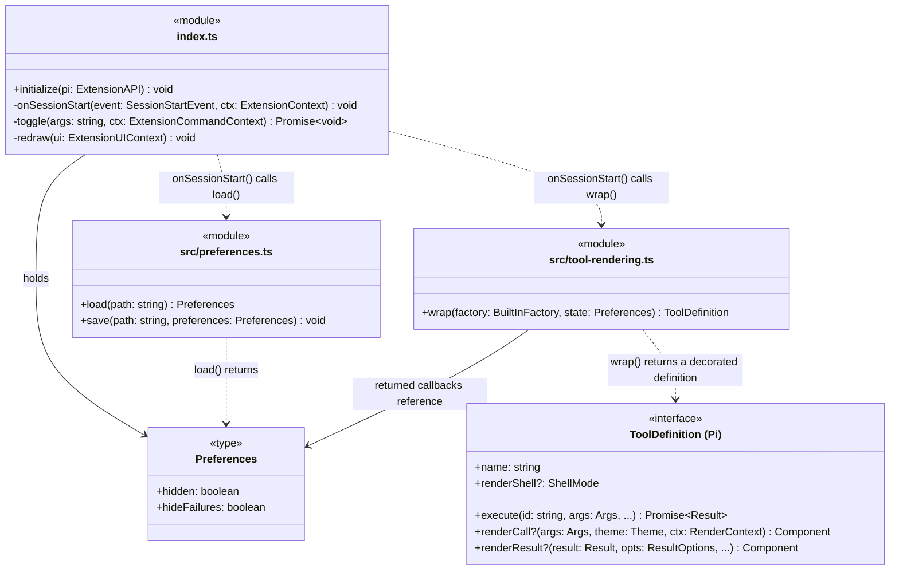

# Architecture

The extension wraps seven of Pi's built-in tools to hide their terminal text and surrounding boxes.
Execution and stored results stay unchanged. All other extensions' tools keep their own rendering.

Supported Pi versions: 0.99.1 and 0.99.2.

## Class diagram

### Diagram conventions

- Module boxes contain functions. `+` means exported and `-` internal in the extension.
  `onSessionStart` and `toggle` are named callbacks inside `initialize`. Their argument and
  return types are inferred from Pi. `Preferences` is a plain shared object declared in
  `src/preferences.ts`; rendering imports only its type, not the persistence functions.
- Solid arrows mean a reference; dotted arrows mean a dependency or the labelled call.
- Pi's optional renderers are function properties, shown as methods. The wrapper supplies both.
  Other definition fields are preserved but omitted here.
- `toggle` also calls `save` and `redraw`; those edges and renderer-internal helpers are omitted.
- `...` means omitted parameters, not a variadic argument: `signal`, `onUpdate`, and `ctx` for
  `execute`; `theme` and `ctx` for `renderResult`.
- Diagram aliases: `Args` is `Static
`; `Result` is `AgentToolResult<D>`; `RenderContext` is
  `ToolRenderContext<S, Args>`; `ResultOptions` is `ToolRenderResultOptions`; `ShellMode` is
  `"default" | "self"`. `BuiltInFactory` is `(cwd: string) => ToolDefinition<P, D, S>`.
  `wrap` preserves schema, details, and renderer-state generics for each tool separately.
- Pi supplies the API/context/theme/definition types; Pi TUI supplies `Component`.

## Responsibilities

### Lifecycle and command (`index.ts:11-105`)

- Register `/hide-tools` and `session_start`; defer tool registration until interactive startup.
  Check for mode `"tui"`. `hasUI` alone would incorrectly include RPC mode.
- Load the preference and inspect ownership with `pi.getAllTools()`. Only wrap the seven target
  names whose current source is `builtin`. Skip absent tools and warn about other overrides.
- Track registrations by source path and reuse them on repeated session starts. Report a changed
  winning definition at the next toggle or session start.
- Construct read/bash factories with effective Pi settings. Fetch settings when executing too,
  so bash shell path/command prefix and image auto-resize do not revert to factory defaults.
  Use Pi's in-memory `SettingsManager` getters for shell-path normalization (home-relative,
  file URLs, and platform-specific paths), not the raw `getSettings()` value.
- Preserve metadata and tool availability. Never use `exposure: "hidden"` to hide presentation:
  that would make the tool unreachable. Registration and toggles do not change the active set.
- With no argument, toggle `hidden`. With `failures`, toggle `hideFailures` without changing
  `hidden`. Reject other arguments with a usage warning. Failures are included by default.
- Update the shared preferences object in place so existing rows see both choices. Redraw through
  an expand/collapse round trip and save both choices. Restore the global Ctrl+O state.
  Individual mouse-expanded rows reset to that global state.

### Tool rendering (`src/tool-rendering.ts:11-79`)

- Spread Pi's definition and delegate execution with original arguments, signal, update callback,
  and context. Construct against `ctx.cwd`, not the startup working directory. Return results
  and throw errors unchanged. No model context or session events are rewritten.
- Set `renderShell: "self"`. Return empty `Container`s from both slots when hidden, including
  failures by default. Pi then draws zero text lines, including no surrounding blank shell.
- Use `context.isError` and `hideFailures` for both slots. With `hidden: true` and
  `hideFailures: false`, failed calls and results stay visible while other rows remain hidden.
- Always run the original renderers, including while hidden, then suppress their output.
  Bash's renderer starts/stops its elapsed timer; skipping a hidden completion leaks that timer.
  For visible default-shell tools, recreate Pi's `Box`; edit keeps its own shell.
- Keep original call/result components and the default shell in a `WeakMap` keyed by Pi's
  per-row state. Never pass the empty placeholder or surrounding shell as the original
  renderer's `lastComponent`. Preserve asynchronous invalidation and shared renderer state.
- Clear a cached component if its renderer throws, matching Pi's fresh-component retry. This
  prevents a failed write-render transition from repeatedly reusing an incompatible component.
  Let Pi show its fallback when a row should be visible; keep hidden rows empty on render errors.

### Preferences (`src/preferences.ts:5-38`)

- Store `{ "hidden": boolean, "hideFailures": boolean }` under `getAgentDir()/pi-hide-tools.json`.
  Defaults are `hidden: false` and `hideFailures: true`. Older files with only `hidden` retain
  that value and default `hideFailures` to `true`; startup does not rewrite them.
- A missing, invalid, or unreadable file uses the defaults. Invalid and unreadable files also
  produce a warning. Startup does not overwrite the file. There is no project-specific preference.
- Save via a unique temporary file in the same directory and atomic rename. Clean up the
  temporary file on success/failure. A failed save leaves the toggle active for this session
  and reports that persistence failed. Rendering never reads or writes files.
- Use a regular preference file: atomic saving replaces a symlink rather than following it.

## Compatibility boundaries

### Ownership and lifecycle

Pi exposes tool metadata through `getAllTools`, but not another extension's executable definition.
It keeps one winning definition per name. Ownership cannot be checked at top-level extension
load, so registration waits until `session_start` to avoid replacing another extension's tool.

A row captures its definition when Pi constructs it. Initial resume binds extensions before
history rendering, but `/reload` and session switching can render history before `session_start`.
Those restored rows can stay visible because toggling cannot replace their captured definitions.
Restarting Pi with the same saved session hides them. New rows use the registered wrappers.

Later registrations follow Pi's first-wins ordering. The extension can detect a changed winner,
but cannot detect every losing registration or safely combine definitions from other extensions.
Existing competing overrides are preserved in both load orders.

Support is scoped to the normal Pi CLI. An SDK application can supply custom base-tool
implementations that Pi still labels `builtin`; this metadata-only check cannot distinguish
those from the stock tools. SDK applications with custom base tools should not load this extension.

### Images and exports

- Pi draws inline images separately from the text renderers, so they can remain visible.
- Session files, model context, and HTML exports retain tool content. Hiding does not redact data.
- Pi's HTML exporter directly renders bash/read/write/edit/ls. Grep/find can use custom
  renderers followed by raw-result fallback. Tests check that all seven retain their results.
- There is no export discriminator in the public renderer context. Do not introduce prototype
  patches or command interception to change export behaviour.

## Testing

Tests cover tool execution and rendering, Pi's extension lifecycle, and terminal behaviour in
isolated tmux sessions. See the [testing guide](../../validation.md) for commands and coverage.

## Pi API references

The following files in [Pi's coding-agent package][pi] define the relevant behaviour.
Paths are relative to the installed package:

- `dist/core/extensions/types.d.ts`: tool rendering context, shell, definition, mode, and metadata.
- `dist/core/extensions/loader.js` and `runner.js`: dynamic registration and first-wins ordering.
- `dist/core/agent-session.js`: metadata, registry, factory settings, and HTML export.
- `dist/modes/interactive/interactive-mode.js`: initial versus replacement binding/render order.
- `dist/modes/interactive/components/tool-execution.js`: captured definitions, empty self shells,
  renderer error handling, and separate image rendering.
- `dist/core/export-html/{index,template,tool-renderer}.js`: export rendering and fallback.

[pi]: https://github.com/earendil-works/pi/tree/v0.99.2/packages/coding-agent
