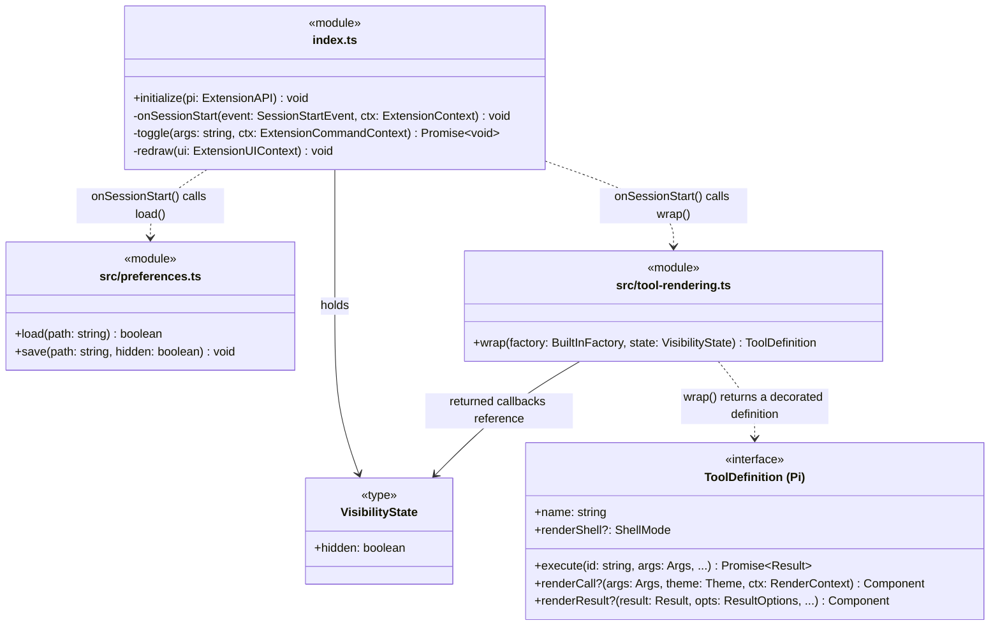

# Architecture

Implemented and tested against Pi 0.99.1 and 0.99.2. This is a selected structure view, not a
complete call graph. Hide the text and framing of seven built-in tools, never their execution
or stored results. AgentShell, Forgetful, web tools, and all other extension tools are untouched.

## Class diagram

### Diagram conventions

- Module boxes contain functions, not classes. `+` means exported and `-` internal for our code.
  `onSessionStart` and `toggle` are named callbacks inside `initialize`. Their argument and
  return types are inferred from Pi. `VisibilityState` is a plain object.
- Solid arrows mean a reference; dotted arrows mean a dependency or the labelled selected call.
  There is no inheritance, container framework, or separate class per tool.
- Pi's optional renderers are function properties, shown as methods. The wrapper supplies both.
  Other definition fields are preserved but omitted here.
- `toggle` also calls `save` and `redraw`; those edges and renderer-internal helpers are omitted.
- `...` means omitted parameters, not a variadic argument: `signal`, `onUpdate`, and `ctx` for
  `execute`; `theme` and `ctx` for `renderResult`.
- Diagram aliases: `Args` is `Static
`; `Result` is `AgentToolResult<D>`; `RenderContext` is
  `ToolRenderContext<S, Args>`; `ResultOptions` is `ToolRenderResultOptions`; `ShellMode` is
  `"default" | "self"`. `BuiltInFactory` is `(cwd: string) => ToolDefinition<P, D, S>`.
  `wrap` preserves schema, details, and renderer-state generics for each tool separately.
- Pi supplies the API/context/theme/definition types; Pi TUI supplies `Component`.

## Responsibilities

### `index.ts`: lifecycle and command

- Register `/hide-tools` and `session_start`; defer tool registration until interactive startup.
  Pi's current interactive mode is `"tui"`. `hasUI` alone would incorrectly include RPC mode.
- Load the preference and inspect ownership with `pi.getAllTools()`. Only wrap the fixed seven
  names whose current source is `builtin`. Skip absent tools and warn about foreign overrides.
- Track our registrations by source path. Reuse them on repeated binds instead of replacing
  captured definitions. A changed winner is reported at the next toggle or session start.
- Construct read/bash factories with effective Pi settings. Fetch settings when executing too,
  so bash shell path/command prefix and image auto-resize do not revert to factory defaults.
  Use Pi's in-memory `SettingsManager` getters for shell-path normalization (home-relative,
  file URLs, and platform-specific paths), not the raw `getSettings()` value.
- Preserve metadata and tool availability. Never use `exposure: "hidden"` to hide presentation:
  that would make the tool unreachable. Registration and toggles do not change the active set.
- Toggle shared state, redraw through an expand/collapse round trip, and save the preference.
  Restore the global Ctrl+O state. Individual mouse-expanded rows reset to that global state.
- Do not intercept `pi.registerTool`, add a shared event bus, or change any other extension.

### `src/tool-rendering.ts`: decorate original definitions

- Spread Pi's definition and delegate execution with original arguments, signal, update callback,
  and context. Construct against `ctx.cwd`, not the startup working directory. Return results
  and throw errors unchanged. No model context or session events are rewritten.
- Set `renderShell: "self"`. Return empty `Container`s from both slots when hidden and not failed.
  Pi then draws zero text lines, including no surrounding blank shell.
- Use `context.isError` for both slots, revealing failed calls and their results.
- Always run the original renderers, including while hidden, then suppress their output.
  Bash's renderer starts/stops its elapsed timer; skipping a hidden completion leaks that timer.
  For visible default-shell tools, recreate Pi's `Box`; edit keeps its own shell.
- Keep original call/result components and the default shell in a `WeakMap` keyed by Pi's
  per-row state. Never pass our empty placeholder or surrounding shell as the original
  renderer's `lastComponent`. Preserve asynchronous invalidation and shared renderer state.
- Clear a cached component if its renderer throws, matching Pi's fresh-component retry. This
  prevents a failed write-render transition from repeatedly reusing an incompatible component.
  Let Pi show its fallback when visible/failed; keep successful hidden rows empty on render errors.

### `src/preferences.ts`: one preference

- Store only `{ "hidden": boolean }` under `getAgentDir()/pi-hide-tools.json`.
- Missing means visible. Invalid/unreadable means visible with an entrypoint warning; startup
  does not overwrite the file. No general configuration layer or project override.
- Save via a unique temporary file in the same directory and atomic rename. Clean up the
  temporary file on success/failure. A failed save leaves the toggle active for this session
  and reports that persistence failed. Rendering never reads or writes files.
- Use a regular preference file: atomic saving replaces a symlink rather than following it.

## Compatibility boundaries

### Ownership and lifecycle

Pi exposes tool metadata through `getAllTools`, not another extension's executable definition.
It also keeps one winning definition per name. Inspecting ownership at top-level extension load
is unavailable, so we intentionally do not register early just to hide restored history.

A row captures its definition when Pi constructs it. Initial resume binds extensions before
history rendering, but `/reload` and session switching can render history before `session_start`.
Offline TUI checks reproduced visible restored rows on those paths in Pi 0.99.2. Toggling cannot
replace their captured definitions. Fresh startup with the same saved session works. New rows
use the registered wrappers. This boundary is documented, not patched through Pi internals.

Later dynamic registrations are subject to Pi's first-wins ordering. We can detect a changed
winner, but cannot detect every losing registration or merge someone else's definition safely.
Existing competing overrides are preserved in both load orders.

Support is scoped to the normal Pi CLI. An SDK application can supply custom base-tool
implementations that Pi still labels `builtin`; this metadata-only check cannot distinguish
those from the stock tools. SDK applications with custom base tools should not load this extension.

### Images and exports

- Inline images are outside this version: Pi draws them separately from the text renderers.
- This is presentation hiding, not redaction. Session and model data remain unchanged.
- Pi's HTML exporter directly renders bash/read/write/edit/ls. Grep/find can use custom
  renderers followed by raw-result fallback. Regression tests preserve recorded results for
  all seven; a browser check confirmed readable exported content while hiding was enabled.
- There is no export discriminator in the public renderer context. Do not introduce prototype
  patches or command interception to change export behaviour.

## Validation boundaries

The implementation followed the agreed TDD boundaries:

1. Real tool execution and rendering, using temporary files, harmless shell commands, streaming,
   cancellation, visible failures, original output, and zero-height hidden rows.
2. Real Pi loading, command dispatch, settings, preferences, reload, tool availability, existing
   override ordering, and a later winning override. Only the terminal is a recording sink.
3. Offline tmux checks for initial resume, toggles, Ctrl+O, errors, lifecycle limits, and actual
   installed AgentShell/Forgetful/web renderers; HTML export checked in a browser.

See [validation notes](../../validation.md) for commands, evidence, and dependency auditing.
Deferred: per-tool configuration, activity widgets, keybindings, thinking/message filtering,
web integration, arbitrary extension-tool hiding, and Firstmate's animated working indicator.

## Evidence

Context7 was quota-limited. The API review used installed Pi 0.99.1 sources and the matching
[official source][pi], then rechecked against installed 0.99.2 after the host was updated.
Paths below are relative to Pi's package, not this repository:

- `dist/core/extensions/types.d.ts`: tool rendering context, shell, definition, mode, and metadata.
- `dist/core/extensions/loader.js` and `runner.js`: dynamic registration and first-wins ordering.
- `dist/core/agent-session.js`: metadata, registry, factory settings, and HTML export.
- `dist/modes/interactive/interactive-mode.js`: initial versus replacement binding/render order.
- `dist/modes/interactive/components/tool-execution.js`: captured definitions, empty self shells,
  renderer error handling, and separate image rendering.
- `dist/core/export-html/{index,template,tool-renderer}.js`: export rendering and fallback.

[Firstmate][firstmate], inspected at `65c75b0d`, supplied the rendering idea, not copied code:
`.pi/extensions/fm-calm.ts` and `docs/calm.md`.

[pi]: https://github.com/earendil-works/pi/tree/v0.99.1/packages/coding-agent
[firstmate]: https://github.com/kunchenguid/firstmate/tree/65c75b0d
